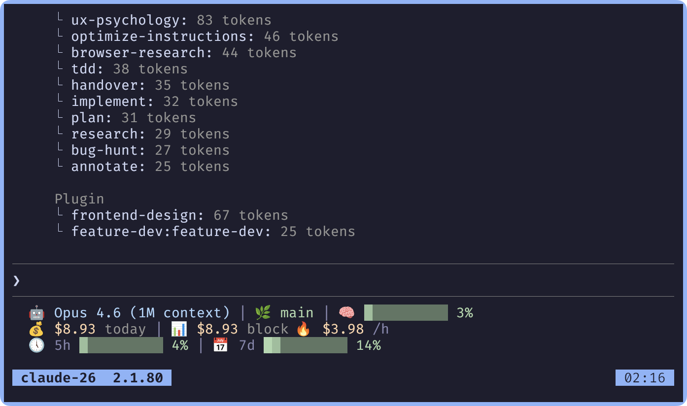

# cc-statusline

A fast statusline for [Claude Code](https://docs.anthropic.com/en/docs/claude-code) that displays model info, context usage, cost tracking, and burn rate. Written in Zig for minimal latency.



## Features

- **Model & Context** — Current model name, git branch, context window usage with color-coded progress bar (green → yellow → red)
- **Cost Tracking** — Today's total cost, current block cost (5h window) with remaining time, burn rate per hour
- **Smart Caching** — Two-tier binary cache (30s result TTL, 5m file list TTL) with incremental diff parsing for near-zero overhead
- **Pricing** — Supports Opus 4.6/4.5/4.1/4/3, Sonnet 4.6/4.5/4.2/4/3.7/3.5, Haiku 4.5/3.5 (including 200K+ tiered pricing)
- **Theming** — Built-in Catppuccin Mocha theme, fully customizable via environment variables

## Requirements

- Zig 0.15.0+

## Build

```sh
zig build -Doptimize=ReleaseFast
```

The binary is output to `zig-out/bin/cc-statusline`.

## Usage

cc-statusline reads Claude Code's statusline JSON from stdin and outputs a 2-line ANSI-colored status:

```text
🤖 Opus 4.6 | 🌿 main | 🧠 ████████████▓░░░░░░░ 63%
💰 $0.20 today | $0.20 block ██████████████▓░░░░░ 4h 39m left 🔥 $0.60 /h
```

### Claude Code Integration

Add to `~/.claude/settings.json`:

```json
{
  "statusline": {
    "command": "/path/to/cc-statusline"
  }
}
```

## Configuration

### Theme

Set `CC_STATUSLINE_THEME` to use a built-in theme:

```sh
export CC_STATUSLINE_THEME=catppuccin-mocha
```

### Color Overrides

Override individual colors with ANSI escape sequences:

| Variable | Description | Default |
|---|---|---|
| `CC_STATUSLINE_COLOR_MODEL` | Model name color | Cyan |
| `CC_STATUSLINE_COLOR_GREEN` | Low context usage | Green |
| `CC_STATUSLINE_COLOR_YELLOW` | Medium context usage | Yellow |
| `CC_STATUSLINE_COLOR_RED` | High context usage | Red |
| `CC_STATUSLINE_COLOR_DIM` | Separators and labels | Dim |
| `CC_STATUSLINE_BAR_FILLED` | Filled bar character | `█` |
| `CC_STATUSLINE_BAR_TRANSITION` | Transition bar character | `▓` |
| `CC_STATUSLINE_BAR_EMPTY` | Empty bar character | `░` |

### Config Directory

By default, cc-statusline reads from `~/.claude`. Override with:

```sh
export CLAUDE_CONFIG_DIR=/path/to/config
```

## Test

```sh
zig build test
```
